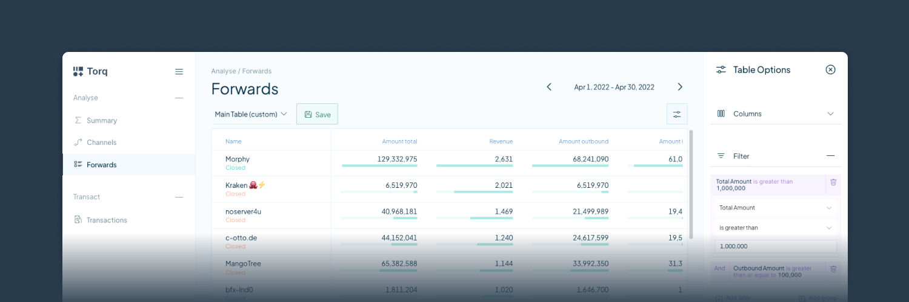

# Torq


Torq is an advanced node management software that helps lightning node operators analyze and automate their nodes. It is designed to handle large nodes with over 1000 channels, and it offers a range of features to simplify your node management tasks, including:

* Analyze, connect and manage all your nodes from one place!
* Access a complete overview of all channels instantly.
* Build advanced automation workflows to automate Rebalancing, Channel Policy, Tagging and eventually any node action.
* Review forwarding history, both current and at any point in history.
* Customize and save table views. Containing only selected columns, advanced sorting and high fidelity filters.
* Export table data as CSV. Finally get all your forwarding or channel data as CSV files.
* Enjoy advanced charts to visualize your node's performance and make informed decisions.

Whether you're running a small or a large node, Torq can help you optimize its performance and streamline your node management process. Give it a try and see how it can simplify your node management tasks.


## Quick start

### Docker compose
To install Torq via docker compose:

```bash
bash -c "$(curl -fsSL https://torq.sh)"
```
You do not need sudo/root to run this, and you can check the contents of the installation script here: https://torq.sh

### Podman
To run the database via host network:

```sh
podman run -d --name torqdb --network=host -v torq_db:/var/lib/postgresql/data -e POSTGRES_PASSWORD="<YourPostgresPasswordHere>" timescale/timescaledb:latest-pg14
```

To run Torq via host network:

First create your TOML configuration file and store it in `~/.torq/torq.conf`

```sh
podman run -d --name torq --network=host -v ~/.torq/torq.conf:/home/torq/torq.conf lncapital/torq:latest --config=/home/torq/torq.conf start
```
**Note**: Only run with host network when your server has a firewall and doesn't automatically open all port to the internet. You don't want the database to be accessible from the internet!

### Kubernetes

We shared templates for CRDs in folder [kubernetes](./kubernetes).
This folder also has its own [readme](./kubernetes/README.md).

### Network

Be aware that when you try Torq on testnet, simnet or some other type of network that you must use the network switch when trying to browse the web interface.
The network switch is the globe icon in the top left corner, next to the Torq logo.


### Guides

We're adding more guides and help articles on [https://docs.ln.capital](docs.ln.capital).

* [How to add a domain for Torq with https](https://docs.ln.capital/en/articles/7323907-how-to-add-a-domain-to-torq-using-caddy).

## Configuration

Torq supports a TOML configuration file. The docker compose install script auto generates this file.
You can find an example configuration file at [example-torq.conf](./docker/example-torq.conf)

It is also possible not to use any TOML configuration files and use command like parameters. The list of parameters are:
 - **--lnd.url**: Host:Port of the LND node (example: "127.0.0.1:10009")
 - **--lnd.macaroon-path**: Path on disk to LND Macaroon (example: "~/.lnd/admin.macaroon")
 - **--lnd.tls-path**: Path on disk to LND TLS file (example: "~/.lnd/tls.cert")
 - **--db.name**: Name of the database (default: "torq")
 - **--db.user**: Name of the postgres user with access to the database (default: "postgres")
 - **--db.password**: Password used to access the database (default: "runningtorq")
 - **--db.port**: Port of the database (default: "5432")
 - **--db.host**: Host of the database (default: "localhost")
 - **--torq.password**: Password used to access the API and frontend (example: "C44y78A4JXHCVziRcFqaJfFij5HpJhF6VwKjz4vR")
 - **--torq.network-interface**: The nework interface to serve the HTTP API (default: "0.0.0.0")
 - **--torq.port**: Port to serve the HTTP API (default: "8080")
 - **--torq.pprof.path**: When pprof path is set then pprof is loaded when Torq boots. (example: "localhost:6060")
 - **--torq.debuglevel**: Specify different debug levels (panic|fatal|error|warn|info|debug|trace) (default: "info")
 - **--torq.vector.url**: Alternative path for alternative vector service implementation (default: "https://vector.ln.capital/")
 - **--torq.cookie-path**: Path to auth cookie file
 - **--torq.no-sub**: Start the server without subscribing to node data (default: "false")
 - **--torq.auto-login**: Allows logging in without a password (default: "false")


## How to Videos

[You can find the full list of video guides here.](https://docs.ln.capital/en/collections/3817618-torq-video-tutorials)

### How to create custom Channel Views

[](https://www.youtube.com/watch?v=5ZfgflfOFwQ)

### How to use Automation Workflows

[](https://www.youtube.com/watch?v=Go4uJoMhwrE)

### How to use the Forwards Tab

[](https://www.youtube.com/watch?v=ZTetH8_jbgk)


## Permissions

Since Torq is built to manage your node, it needs most/all permissions to be fully functional. However, if you want to
be extra careful you can disable some permissions that are not strictly needed.

Torq does not for now need the ability to create new macaroon or stop the LND daemon,

    lncli bakemacaroon \
        invoices:read \
        invoices:write \
        onchain:read \
        onchain:write \
        offchain:read \
        offchain:write \
        address:read \
        address:write \
        message:read \
        message:write \
        peers:read \
        peers:write \
        info:read \
        uri:/lnrpc.Lightning/UpdateChannelPolicy \
        --save_to=torq.macaroon

Here is an example of a macaroon that can be used if you want to prevent all actions that sends funds from your node:

    lncli bakemacaroon \
        invoices:read \
        invoices:write \
        onchain:read \
        offchain:read \
        address:read \
        address:write \
        message:read \
        message:write \
        peers:read \
        peers:write \
        info:read \
        uri:/lnrpc.Lightning/UpdateChannelPolicy \
        --save_to=torq.macaroon

## Help and feedback

Join our [Telegram group](https://t.me/joinchat/V-Dks6zjBK4xZWY0) if you need help getting started.
Feel free to ping us in the telegram group if you have any feature request or feedback.  We would also love to hear your ideas for features or any other feedback you might have.
